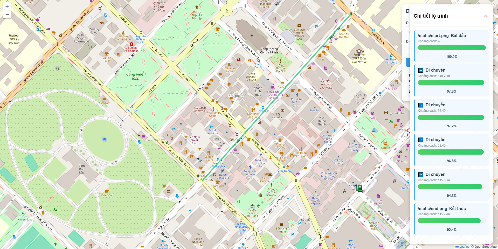

# Đồ án trí tuệ nhân tạo đề tài xe điện
[](https://www.python.org/)

Ứng dụng web tìm đường đi tối ưu cho xe điện trong khu vực, hỗ trợ các trạm sạc điện, sử dụng thuật toán A* và Uniform Cost Search (UCS). Hỗ trợ ưu tiên tìm đến trạm sạc gần nhất nếu có dấu hiệu không đủ điện đến đích (Sử dụng thuật toán A* để tìm đường đến trạm sạc gần nhất). Hiển thị trên bản đồ OSM thông qua Leaflet.

## 🛠 Công nghệ sử dụng
- Python + Flask
- OpenStreetMap (qua thư viện `osmnx`)
- Thuật toán: A*, UCS (tự cài đặt)
- LeafletJS (frontend bản đồ)
- Nominatim API (geocoding)

## 🚀 Cách chạy ứng dụng

### 1. Cài đặt môi trường
Tạo môi trường ảo và cài đặt các thư viện cần thiết:

```bash
pip install -r requirements.txt
```
### 2. Chuẩn bị file toạ độ các trạm sạc [charging.txt](charging.txt) 
```bash
10.776889 106.700806
10.781111 106.695500
10.772800 106.684400
```
### 3. Chạy chương trình
```bash
python app.py
```


